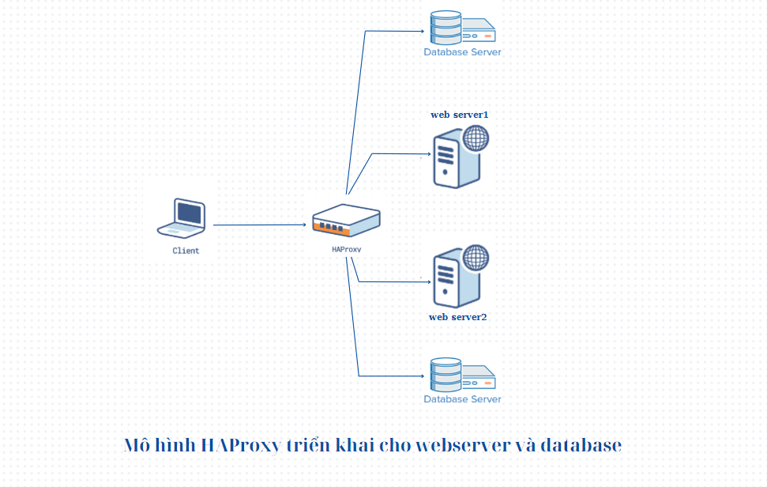

# HAproxy-for-web-database-server
This project demonstrates how to simply deploy and configure HAproxy for web and database server.
This is a diagram of the system that will be deployed

For detail demo, please read the document and watch our videos [here](https://youtube.com/playlist?list=PLc3Hehfybgf0n4Jc5j-SeTW7pc3jYspov&si=dqW9DNGA6G9G9a4_).
